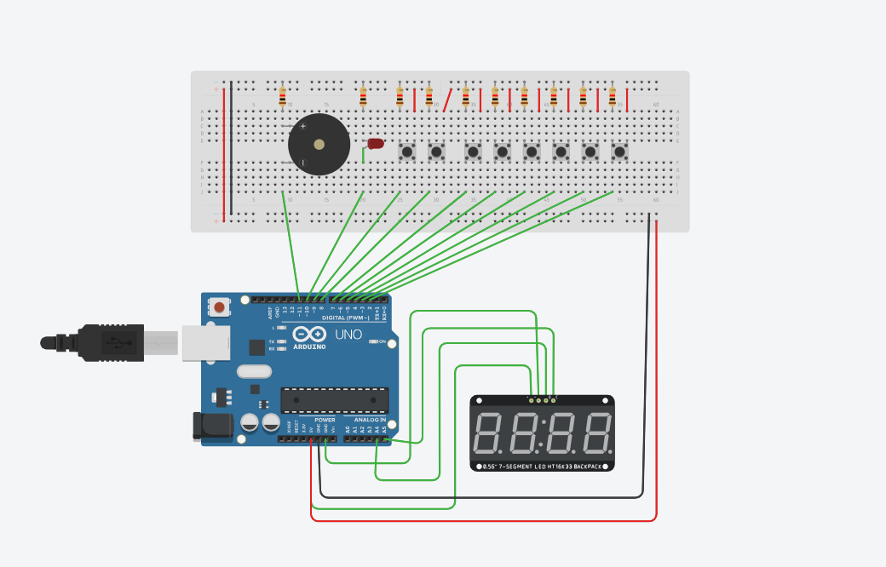

# システムの概要
完成日 (2024/07/30)

## 入力

| id | 入力 | 説明 |
|---:|---|---|
| 1 | スタート/ストップ | **0:00(未設定)** から押すとカウントアップ開始。**時間設定済み**で押すとカウントダウン開始。動作中に押すと一時停止、停止中に押すと再開。 |
| 2 | リセット | 状態を初期化して **0:00** に戻す（アラーム解除もこれ）。 |
| 3 | +1秒 | 未動作時のみ、秒を **+1**（時間設定状態へ）。 |
| 4 | +10秒 | 未動作時のみ、秒を **+10**（時間設定状態へ）。 |
| 5 | +1分 | 未動作時のみ、分を **+1**（時間設定状態へ）。 |
| 6 | +10分 | 未動作時のみ、分を **+10**（時間設定状態へ）。 |
| 7 | プリセット(3:00) | 未動作時のみ、**3:00** をセット。 |
| 8 | プリセット(5:00) | 未動作時のみ、**5:00** をセット。 |

> 「未動作時」= 未設定 / 時間設定中（カウント中・一時停止中は加算できない）

## 出力

| id | 出力 | 説明 |
|---:|---|---|
| 1 | 7セグ表示 | `mm:ss` を表示（コロン常時点灯）。 |
| 2 | LED | アラーム中のみ **点滅（約0.5秒周期）**。それ以外は消灯。 |
| 3 | ブザー | アラーム中のみ **ON**。それ以外はOFF。 |

## 制約事項

- 表示・保持できる最大は **99:59**（超えたら 99:59 にクリップ）
- アラームは **カウントダウンが 0:00 到達**したときだけ発生
- アラーム解除は **リセットのみ**
